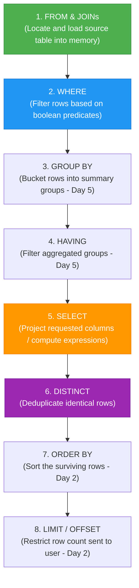

# 📚 Day 01 Deep-Dive Theory: SELECT, FROM, WHERE, DISTINCT & Modulo

---

## 🗺️ 1. The Big Picture: How SQL Views Data

In relational databases (RDBMS), data is stored in **Tables (Relations)** consisting of **Attributes (Columns)** and **Tuples (Rows)**.

```text
Table: CITY
+----+---------------+-------------+-------------+------------+
| ID | NAME          | COUNTRYCODE | DISTRICT    | POPULATION |
+----+---------------+-------------+-------------+------------+
| 1  | Los Angeles   | USA         | California  | 3970000    |
| 2  | Tokyo         | JPN         | Tokyo-to    | 9000000    |
| 3  | Scottsdale    | USA         | Arizona     | 110000     |
| 4  | Osaka         | JPN         | Osaka       | 2600000    |
| 5  | Smalltown     | USA         | Texas       | 45000      |
+----+---------------+-------------+-------------+------------+
```

SQL operates using **Set Theory**. When you run a query, you are transforming a large set of rows into a targeted subset through filtering and projection.

---

## ⚙️ 2. The Golden Concept: Logical Execution Order

One of the biggest pitfalls for beginners is assuming SQL executes top-to-bottom like Python or JavaScript. **It does not.**

### Flowchart: Query Execution Lifecycle



### Why this matters:
1. Because **`FROM`** runs first, the database confirms the table exists.
2. Because **`WHERE`** runs second, it evaluates rows **before** columns are picked.
3. Because **`SELECT`** runs fifth, any column alias defined in `SELECT` (e.g. `SELECT population AS pop`) **cannot** be used inside `WHERE` (e.g. `WHERE pop > 100` ❌ causes an error!).

---

## 🔍 3. Core Clauses Breakdown

### A. The `FROM` Clause
Specifies the target table to read data from.
```sql
FROM CITY;
```

### B. The `WHERE` Clause (Row Filter)
Evaluates a boolean condition for every row. If the condition evaluates to `TRUE`, the row is retained. If `FALSE` or `NULL`, the row is discarded.

#### Comparison Operators:
| Operator | Meaning | Example |
|---|---|---|
| `=` | Equal to | `COUNTRYCODE = 'USA'` |
| `<>` or `!=` | Not equal to | `COUNTRYCODE <> 'USA'` |
| `>` | Greater than | `POPULATION > 100000` |
| `<` | Less than | `POPULATION < 50000` |
| `>=` | Greater than or equal to | `POPULATION >= 100000` |
| `<=` | Less than or equal to | `POPULATION <= 100000` |

#### Boolean Logic Operators:
- **`AND`**: Both conditions must be `TRUE`.
  ```sql
  WHERE COUNTRYCODE = 'USA' AND POPULATION > 100000
  ```
- **`OR`**: At least one condition must be `TRUE`.
  ```sql
  WHERE COUNTRYCODE = 'USA' OR COUNTRYCODE = 'JPN'
  ```
- **`NOT`**: Inverts the condition.
  ```sql
  WHERE NOT (COUNTRYCODE = 'USA')
  ```

---

### C. The `SELECT` Clause (Column Projection)
Specifies which attributes to output.
- `SELECT *`: Returns every column defined in the table.
- `SELECT NAME, POPULATION`: Returns only the specified columns in that exact order.

---

### D. The `DISTINCT` Keyword (Set Deduplication)
When querying categorical data (e.g., city names, country codes), multiple rows may contain identical values. `DISTINCT` eliminates duplicate rows.

```sql
SELECT DISTINCT CITY
FROM STATION;
```

> **Important**: `SELECT DISTINCT CITY, STATE` checks for uniqueness of the **combination** of `(CITY, STATE)`.

---

### E. Modulo Arithmetic (`MOD()` vs `%`)
Modulo finds the remainder of integer division:
- Even numbers divided by 2 have a remainder of `0`.
- Odd numbers divided by 2 have a remainder of `1`.

| Dialect | Even Condition | Odd Condition |
|---|---|---|
| **MySQL / Oracle** | `MOD(ID, 2) = 0` | `MOD(ID, 2) = 1` or `MOD(ID, 2) <> 0` |
| **PostgreSQL / SQL Server** | `ID % 2 = 0` | `ID % 2 = 1` or `ID % 2 <> 0` |

---

## ⚠️ 4. Top 5 Traps & Common Errors

1. **Quotation Rules**:
   - String literals: Always single quotes (`'USA'`, `'New York'`).
   - Numbers: Never use quotes (`100000`, `1661`).
   - Identifiers (column/table names): No quotes needed.
2. **Trailing Commas**:
   - `SELECT ID, NAME, FROM CITY;` ❌ (*Syntax error before `FROM`*)
   - `SELECT ID, NAME FROM CITY;` ✅
3. **Missing `AND` in range filtering**:
   - `WHERE 50000 < POPULATION < 100000` ❌ (*Invalid SQL*)
   - `WHERE POPULATION > 50000 AND POPULATION < 100000` ✅
4. **`DISTINCT` Placement**:
   - `SELECT CITY, DISTINCT STATE` ❌ (*`DISTINCT` must appear immediately after `SELECT`*)
   - `SELECT DISTINCT CITY, STATE` ✅
5. **Null Values**:
   - `WHERE column = NULL` ❌ (*Will always evaluate to UNKNOWN / False*)
   - `WHERE column IS NULL` ✅
