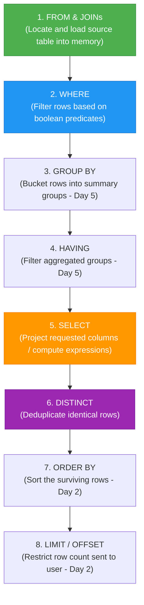

# 📚 Day 01 Deep-Dive Theory: SELECT, FROM, WHERE, DISTINCT & Modulo

---

## 🗺️ 1. The Big Picture: How SQL Views Data

In relational databases (RDBMS), data is stored in **Tables (Relations)** consisting of **Attributes (Columns)** and **Tuples (Rows)**.

```text
Table: CITY
+----+---------------+-------------+-------------+------------+
| ID | NAME          | COUNTRYCODE | DISTRICT    | POPULATION |
+----+---------------+-------------+-------------+------------+
| 1  | Los Angeles   | USA         | California  | 3970000    |
| 2  | Tokyo         | JPN         | Tokyo-to    | 9000000    |
| 3  | Scottsdale    | USA         | Arizona     | 110000     |
| 4  | Osaka         | JPN         | Osaka       | 2600000    |
| 5  | Smalltown     | USA         | Texas       | 45000      |
+----+---------------+-------------+-------------+------------+
```

SQL operates using **Set Theory**. When you write a query, you are transforming a large set of rows into a targeted subset through filtering and projection.

---

## ⚙️ 2. The Golden Concept: Logical Execution Order

One of the biggest pitfalls for beginners is assuming SQL executes top-to-bottom like Python or JavaScript. **It does not.**

### Flowchart: Query Execution Lifecycle



### Why this matters:
1. Because **`FROM`** runs first, the database confirms the table exists.
2. Because **`WHERE`** runs second, it evaluates rows **before** columns are picked.
3. Because **`SELECT`** runs fifth, any column alias defined in `SELECT` (e.g. `SELECT population AS pop`) **cannot** be used inside `WHERE` (e.g. `WHERE pop > 100` is invalid).

---

## 🔍 3. Deep-Dive: The `WHERE` Clause & Modulo Arithmetic (`MOD`)

### What is `MOD` (Modulo)?
Modulo calculates the **remainder** left over after integer division:

```text
       3  <-- Quotient (How many whole times it fits)
     ____
  4 ) 14  <-- Dividend (The number you start with)
     -12  <-- (4 × 3)
     ____
       2  <-- REMAINDER  ===>  MOD(14, 4) = 2
```

### Modulo Lookup Reference Table:
| Expression | Calculation | Result | Meaning / Category |
|---|---|---|---|
| `MOD(10, 2)` | 10 = (5 × 2) + 0 | **0** | Even number (Divisible by 2) |
| `MOD(11, 2)` | 11 = (5 × 2) + 1 | **1** | Odd number |
| `MOD(10, 3)` | 10 = (3 × 3) + 1 | **1** | 1 left over after division by 3 |
| `MOD(12, 3)` | 12 = (4 × 3) + 0 | **0** | Perfect multiple of 3 |
| `MOD(100, 10)`| 100 = (10 × 10) + 0 | **0** | Perfect multiple of 10 |
| `MOD(7, 10)` | 7 = (0 × 10) + 7 | **7** | When N < M, remainder is N |

---

### Real-World Use Cases for `MOD` in SQL:

#### 1. Even / Odd Parity Filtering
```sql
-- Even IDs
SELECT * FROM orders WHERE MOD(order_id, 2) = 0;

-- Odd IDs
SELECT * FROM orders WHERE MOD(order_id, 2) = 1;
```

#### 2. Systematic Data Sampling (e.g., Extract Every 10th Record)
In big data environments (billions of rows), you often want a quick representative sample without scanning everything:
```sql
SELECT * 
FROM clickstream_events
WHERE MOD(event_id, 10) = 0; -- Yields an exact 10% systematic sample
```

#### 3. A/B Testing & Multi-Cohort Bucketing
Split active users into 3 distinct test variants based on their numerical ID:
```sql
SELECT 
    user_id,
    email,
    CASE 
        WHEN MOD(user_id, 3) = 0 THEN 'Variant A (Control)'
        WHEN MOD(user_id, 3) = 1 THEN 'Variant B (New Checkout)'
        WHEN MOD(user_id, 3) = 2 THEN 'Variant C (One-Click Buy)'
    END AS experiment_cohort
FROM users;
```

#### 4. Time and Duration Breakdown
Convert total call seconds (e.g., 145 seconds) into minutes and remaining seconds:
```sql
SELECT 
    call_id,
    FLOOR(duration_seconds / 60) AS call_minutes,
    MOD(duration_seconds, 60)    AS remaining_seconds
FROM support_calls;
```

---

## 💎 4. Deep-Dive: Set Deduplication with `DISTINCT`

### 1. Why `DISTINCT` Exists
Databases store relational entities where attributes repeat. If you select a column like `CITY` from `STATION`, the same city name may appear across multiple records with different IDs.

```text
Input Table: STATION
+----+------------+-------+
| ID | CITY       | STATE |
+----+------------+-------+
| 10 | Austin     | TX    |
| 12 | Denver     | CO    |
| 14 | Austin     | TX    | <-- Duplicate city
| 16 | Seattle    | WA    |
+----+------------+-------+
```

```sql
SELECT DISTINCT CITY FROM STATION;
```

**Result Set (Duplicates Removed):**
```text
Austin
Denver
Seattle
```

### 2. Crucial Rule: Multi-Column `DISTINCT`
When multiple columns are specified, `DISTINCT` evaluates the **entire combination (tuple)** of all selected columns, NOT just the first column:

```sql
SELECT DISTINCT CITY, STATE FROM STATION;
```
- If you have `(Austin, TX)` and `(Austin, TX)`, only one is returned.
- If you have `(Austin, TX)` and `(Austin, MN)`, **both** are returned because the `(CITY, STATE)` pair is unique!

### 3. Syntax Rules:
- `SELECT DISTINCT CITY, STATE` ✅
- `SELECT CITY, DISTINCT STATE` ❌ *(Syntax error: DISTINCT must follow SELECT immediately)*

---

## ⚠️ 5. Top 5 Traps & Common Gotchas

1. **Quotation Rules**:
   - String literals: Always single quotes (`'USA'`, `'JPN'`).
   - Numbers: Never use quotes (`100000`, `1661`).
   - Identifiers (column/table names): No quotes needed.
2. **Trailing Commas**:
   - `SELECT ID, NAME, FROM CITY;` ❌ (*Syntax error*)
   - `SELECT ID, NAME FROM CITY;` ✅
3. **Table Grain & Entity Semantics**:
   - Always verify what 1 row represents. In `CITY`, each row is a city, so `NAME` is the city name (not a customer or person).
4. **Modulo Dialect Differences**:
   - MySQL/Postgres/Snowflake: Supports both `MOD(id, 2) = 0` and `id % 2 = 0`.
   - Oracle: Only supports `MOD(id, 2) = 0`.
   - MS SQL Server: Only supports `id % 2 = 0`.
5. **Null Values**:
   - `WHERE column = NULL` ❌ *(Always evaluates to UNKNOWN)*
   - `WHERE column IS NULL` ✅
