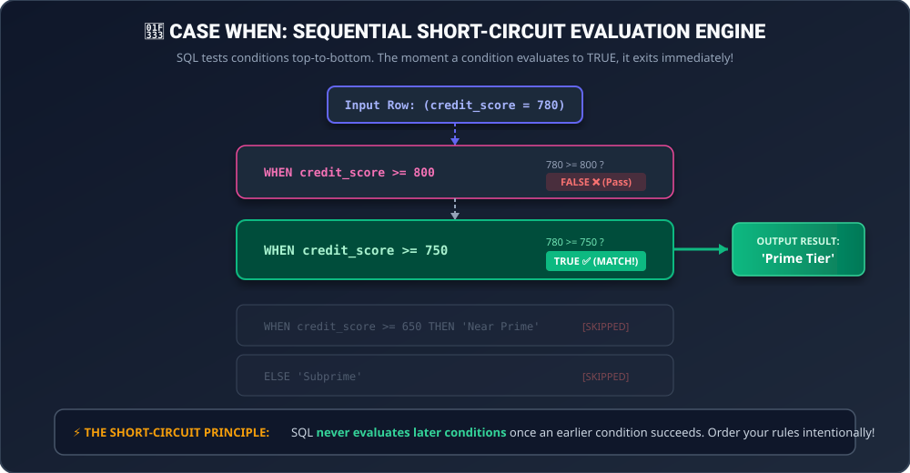

# 📚 Complete Study Guide: Conditional Logic & `CASE WHEN` in SQL

> **Phase**: Phase 2 — Advanced Select  
> **Target Audience**: Data Analysts, Financial Analysts, Analytics Engineers  
> **Dialect**: Standard SQL / MySQL 8.0+

---

## 🧠 1. What is `CASE WHEN`? (The Core Mental Model)

In standard programming languages (Python, JavaScript, C++), you use `if / elif / else` to make decisions.  
In SQL, **`CASE WHEN` is the universal conditional branching engine**.

It allows you to:
1. **Create custom categories & buckets** (e.g. converting numeric credit scores into `'Prime'` vs `'Subprime'`).
2. **Apply conditional business rules** (e.g. calculating discounts based on order size).
3. **Classify geometric shapes or entity states** (e.g. `TRIANGLES`).
4. **Conditionally aggregate metrics** (e.g. `SUM(CASE WHEN status = 'REFUND' THEN amount ELSE 0 END)`).

---

## 🖼️ 2. The Execution Architecture (Short-Circuit Evaluation)



---

## 🏛️ 3. The Two Forms of `CASE` Syntax

SQL provides two syntax styles: **Searched `CASE`** and **Simple `CASE`**.

### Form A: Searched `CASE` (Most Powerful & 95% of Real-World Work)
Allows complex boolean expressions, inequality comparisons (`>`, `<`, `>=`), ranges (`BETWEEN`), and multi-column combinations (`AND` / `OR`).

```sql
CASE
    WHEN condition_1 THEN 'Result 1'
    WHEN condition_2 THEN 'Result 2'
    WHEN condition_3 THEN 'Result 3'
    ELSE 'Default Result'
END AS column_alias
```

#### 💼 Corporate Finance Example:
```sql
SELECT customer_id,
       credit_score,
       CASE
           WHEN credit_score >= 800 THEN 'Tier 1: Exceptional'
           WHEN credit_score >= 740 THEN 'Tier 2: Very Good'
           WHEN credit_score >= 670 THEN 'Tier 3: Good'
           WHEN credit_score >= 580 THEN 'Tier 4: Fair'
           ELSE 'Tier 5: Subprime High Risk'
       END AS credit_risk_tier
FROM Customers;
```

---

### Form B: Simple `CASE` (Exact Value Matching)
Used only when you are comparing a **single column against exact discrete values**.

```sql
CASE column_name
    WHEN 'Value_1' THEN 'Result 1'
    WHEN 'Value_2' THEN 'Result 2'
    ELSE 'Default Result'
END AS column_alias
```

#### 💼 Global Commerce Example:
```sql
SELECT customer_id,
       country,
       CASE country
           WHEN 'USA' THEN 'North America'
           WHEN 'CAN' THEN 'North America'
           WHEN 'MEX' THEN 'North America'
           WHEN 'GBR' THEN 'Europe'
           WHEN 'DEU' THEN 'Europe'
           WHEN 'JPN' THEN 'Asia-Pacific'
           ELSE 'Other Region'
       END AS global_region
FROM Customers;
```

---

## ⚖️ 4. The 4 Immutable Rules of `CASE WHEN`

### 1. The Short-Circuit Rule (Order is King)
SQL tests `WHEN` clauses **sequentially from top to bottom**. The moment a condition evaluates to `TRUE`, the database engine **immediately assigns the result and ignores all remaining clauses**.

```sql
-- ❌ BAD LOGIC (The Trap):
CASE
    WHEN salary >= 50000 THEN 'Mid Earner'
    WHEN salary >= 100000 THEN 'High Earner'  -- ⚠️ NEVER REACHED! If salary = 120,000, line 1 is True!
    ELSE 'Entry Level'
END

-- ✅ CORRECT LOGIC:
CASE
    WHEN salary >= 100000 THEN 'High Earner'
    WHEN salary >= 50000 THEN 'Mid Earner'
    ELSE 'Entry Level'
END
```

---

### 2. The Data Type Uniformity Rule
All `THEN` branches and the `ELSE` branch **must return compatible data types**. You cannot return a string in one branch and an integer in another.

```sql
-- ❌ INVALID SQL:
CASE
    WHEN status = 'ACTIVE' THEN 100          -- Integer
    ELSE 'Inactive Account'                 -- String (Type Mismatch Error!)
END

-- ✅ VALID SQL:
CASE
    WHEN status = 'ACTIVE' THEN '100'
    ELSE 'Inactive Account'
END
```

---

### 3. The Silent `NULL` Default Trap
If no `ELSE` clause is specified and **none of the `WHEN` conditions match**, SQL automatically returns **`NULL`**.

```sql
-- If status is 'PENDING', this returns NULL:
CASE
    WHEN status = 'COMPLETED' THEN 'Paid'
    WHEN status = 'FAILED' THEN 'Declined'
    -- Missing ELSE!
END
```
> [!TIP]
> **Best Practice**: Always include an explicit `ELSE` clause (even if it's `ELSE 'Other'` or `ELSE 0`) to prevent accidental `NULL` values.

---

### 4. `CASE` is an Expression, NOT a Statement
Because `CASE` evaluates to a scalar value, you can place it **anywhere an expression is valid**:
- Inside **`SELECT`** (to create categorized columns)
- Inside **`WHERE`** (for dynamic filtering)
- Inside **`ORDER BY`** (for custom priority sorting)
- Inside **`SUM()` / `COUNT()`** (conditional aggregation)

---

## 📐 5. Deep-Dive: Deconstructing "Type of Triangle"

Let's dissect why geometry classification is the #1 interview problem for `CASE WHEN`.

You are given three side lengths: $A, B, C$.

### The 4 Geometric Cases & Hierarchy:

```text
                               ┌────────────────────────────────┐
                               │  Does it satisfy Triangle      │
                               │  Inequality Theorem?           │
                               │  A + B > C AND A + C > B ...   │
                               └──────────────┬─────────────────┘
                                              │
                     ┌────────────────────────┴────────────────────────┐
                     ▼                                                 ▼
             [NO: A+B <= C...]                                       [YES]
                     │                                                 │
          ┌──────────────────────┐                      ┌──────────────┴──────────────┐
          │   'Not A Triangle'   │                      ▼                             ▼
          └──────────────────────┘              [All 3 Sides Equal?]          [Any 2 Sides Equal?]
                                                A = B AND B = C               A = B OR B = C OR A = C
                                                        │                             │
                                                        ▼                             ▼
                                                ┌───────────────┐             ┌───────────────┐
                                                │ 'Equilateral' │             │  'Isosceles'  │
                                                └───────────────┘             └───────────────┘
                                                                                      │
                                                                                      ▼
                                                                             [All 3 Different]
                                                                                      │
                                                                                      ▼
                                                                              ┌───────────────┐
                                                                              │   'Scalene'   │
                                                                              └───────────────┘
```

### ⚠️ The Geometry Trap:
A shape with side lengths `20, 20, 40` has $A = B$.  
If you test `WHEN A = B THEN 'Isosceles'` first, SQL will assign `'Isosceles'`, which is **mathematically impossible** because $20 + 20 = 40$ (the sides lie completely flat and form a line, not a triangle).

Therefore, **you MUST test the invalid condition FIRST**:
```sql
SELECT 
    CASE
        WHEN A + B <= C OR A + C <= B OR B + C <= A THEN 'Not A Triangle'
        WHEN A = B AND B = C THEN 'Equilateral'
        WHEN A = B OR B = C OR A = C THEN 'Isosceles'
        ELSE 'Scalene'
    END
FROM TRIANGLES;
```
